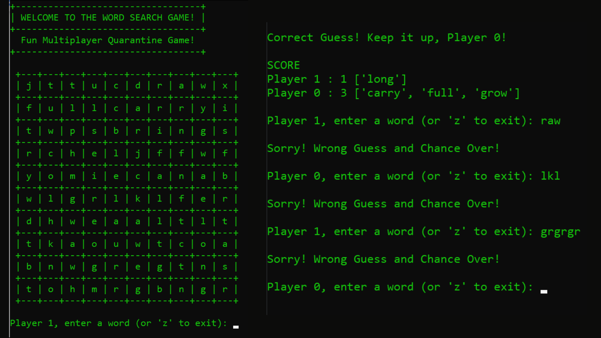

## Word Search Game (Python)

### This is a simple multiplayer word search game made completely in Python language and run in Command Prompt.

__Gameplay__
- The a random csv file containing the alphabet table and answer is created chosen and the players (turn by turn) are asked to look at the table and guess a word.
- If word is present with its alphabets consecutively either in top, down, left (reverse) or right order, then that word is **capitalized** and added to the scorelist.

Some screenshots of the game:

1. 
